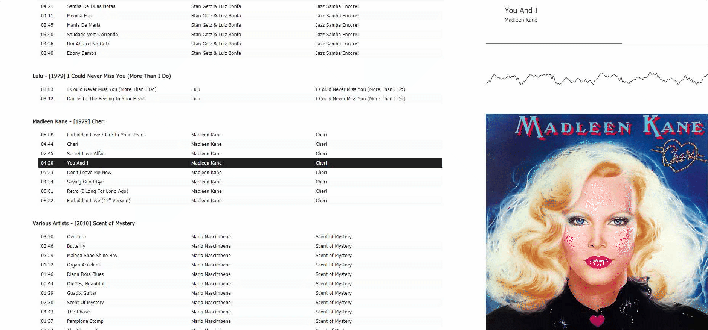

# Music Player :musical_note:
Self-hosted music player.

\- _for those of us too stubborn to just use Spotify_





## Features :muscle:
- NBUI (not bad user-interface)
- Live _active users_ showing what other users are currently listening to
- Fully mobile and tablet responsive
- Sources tracks from file-system
- Supported File Formats
	- MP3
	- FLAC
- Uses track metadata - (falls-back to filename if no [tags](https://www.mp3tag.de/en/) found)
	- Title
	- Artist
	- Album Artist
	- Album
	- Cover Art


## How to setup :bulb:

### Pull from Docker Hub _(the easy way :)_

1. Create a `docker-compose.yml` file

```bash
version: "3"

services:
  music-player:
    image: hmerritt/music-library-player:latest

    environment:
        - REACT_APP_HTTP=http
        - REACT_APP_HOST=localhost:7788
        - REACT_APP_API=http://localhost:7789

    ports:
      - 7788:80
      - 7789:8000

    volumes:
      - path-to-your-music:/app/music
      - /srv/music-library/data:/app/data
```

2. Run docker image using `docker-compose`

```bash
$ docker-compose up
```
